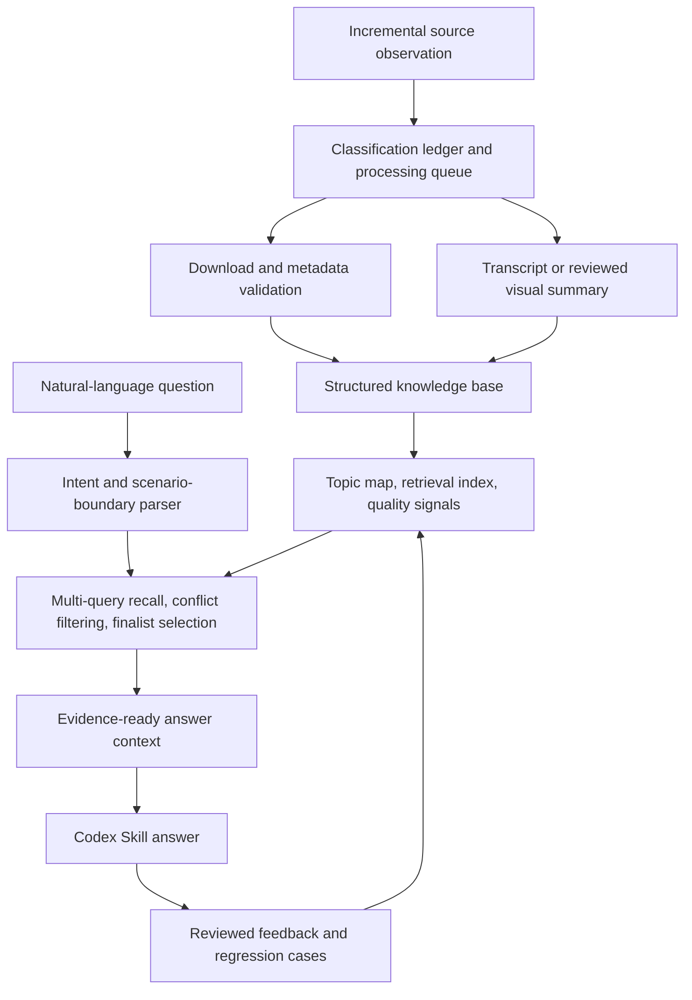

# Badminton Skills Coach

[](https://github.com/MuyuanGuo/badminton-skills-coach/actions/workflows/validate.yml)
[](https://github.com/MuyuanGuo/badminton-skills-coach/releases/latest)
[](LICENSE)


An evidence-backed badminton coaching Skill for Codex. It turns public Chinese coaching videos from Liu Hui Badminton into searchable, citable, regression-tested guidance with video links, timestamps, and explicit evidence boundaries.

[Install the latest release](#install) · [See a real answer](#reviewed-answer-example) · [Project website](https://muyuanguo.github.io/badminton-skills-coach/en/) · [Report answer feedback](https://github.com/MuyuanGuo/badminton-skills-coach/issues/new?template=skill-feedback.yml) · [中文 README](README.md)

The stable channel is [`main`](https://github.com/MuyuanGuo/badminton-skills-coach/tree/main) and the latest formal package is available from [Releases](https://github.com/MuyuanGuo/badminton-skills-coach/releases/latest). Ongoing work lives on `develop`. This project is independent and is not authored, endorsed, or operated by Liu Hui.

## What it does

- Diagnoses technique, footwork, tactics, rotation, serve/receive, and training problems.
- Keeps forehand/backhand, court area, singles/doubles, active/passive state, player roles, and shot direction separate.
- Uses titles and keywords for recall, but requires teaching notes or timestamped transcript evidence for specific claims.
- Assigns text and video different jobs: text explains and plans; video demonstrates spatial movement.
- Returns stable source links, `evidence_id` values, viewing timestamps, and confidence boundaries.
- Turns confirmed user feedback into reviewed regression cases instead of treating feedback as source truth.

## Reviewed answer example

> **Question:** I am late in the rear court and cannot complete my normal preparation. How can I still clear to the baseline?
>
> **Diagnosis:** When the shuttle has already put you under genuine pressure, do not force a large active preparation or a full body turn. Move the racket behind the body earlier from below; as the contact point becomes lower and farther behind, shorten the preparation and swing while preserving racket speed and force transfer.
>
> **Practice:** Rehearse the transition from normal ready position to “racket below and behind, then swing upward.” Add progressively deeper feeds and check only three things: early recognition, a frame that matches the contact point, and sufficient racket speed after shortening the motion.
>
> **Evidence example:** [Forehand passive rear-court clear](https://www.douyin.com/video/7558912953539071292), especially `00:27–00:40` for the preparation path and `01:54–02:03` for earlier contact.

The full reviewed answer also separates forehand overhead and backhand branches, lists confidence limits, and maps every cited video to a stable source identifier.

## Current evidence baseline

| Metric | Current baseline |
| --- | ---: |
| Processed public videos | 474 |
| Ready teaching videos | 353 |
| Transcript-backed evidence | 334 |
| Reviewed visual-summary fallbacks | 19 |
| Maintainer-reviewed answer cases | 57/57 |
| Hard-negative selections in the current regression set | 0 |

These numbers describe the current reviewed corpus and evaluation set. They are not a claim that every possible natural-language question has already been tested.

## Install

Daily use requires Python 3.10 or newer. It does not require an OpenAI API key or transcription dependencies.

```bash
curl -L https://github.com/MuyuanGuo/badminton-skills-coach/releases/download/v1.3.0/liuhui-badminton-coach-v1.3.0.zip \
  -o /tmp/liuhui-badminton-coach-v1.3.0.zip
curl -L https://github.com/MuyuanGuo/badminton-skills-coach/releases/download/v1.3.0/SHA256SUMS.txt \
  -o /tmp/SHA256SUMS.txt
(cd /tmp && shasum -a 256 -c SHA256SUMS.txt)
install_dir="$(mktemp -d)"
unzip -q /tmp/liuhui-badminton-coach-v1.3.0.zip -d "$install_dir"
python3 "$install_dir/liuhui-badminton-coach/scripts/install.py"
```

Restart Codex and ask a concrete question:

```text
$liuhui-badminton-coach I am an intermediate doubles player. Smashes into my
backhand hip make my racket face roll over and my block sits up. Diagnose the
likely causes and give me a 20-minute partner drill.
```

Chinese questions work best because the source videos and evidence notes are primarily Chinese.

## Architecture



The runtime entry point is `skills/liuhui-badminton-coach/scripts/prepare_answer_context.py`. The repository also contains source processing, evaluation, installation, feedback, packaging, and reproducibility tooling.

## Development and verification

Start contributions from `develop` and target pull requests back to `develop`. See [CONTRIBUTING.md](CONTRIBUTING.md) for data, privacy, test, and release rules.

```bash
python3 scripts/doctor.py
python3 scripts/validate_project.py
PYTHONPATH=scripts python3 -m unittest discover -s scripts -p 'test_*.py'
```

Changes to retrieval, evidence, or answer behavior should also run the full quality pipeline:

```bash
python3 scripts/run_full_update_pipeline.py
```

Check whether the committed profile observation, knowledge build, processing queue,
classification review, or blind forward tests need maintenance:

```bash
python3 scripts/check_maintenance_health.py --fail-on overdue
```

Release archives are deterministic, checksum-published, accompanied by a CycloneDX SBOM, and attested by GitHub Actions. See [RELEASE_SECURITY.md](RELEASE_SECURITY.md) for verification instructions.

## License and source boundaries

Original software and automation in this repository use the [MIT License](LICENSE). Third-party video, audio, creator names, titles, thumbnails, transcripts, and other source material are not covered by the MIT grant; see [NOTICE](NOTICE).

The repository does not ship original media, complete transcript directories, temporary media credentials, model caches, or local user feedback. Public links are source citations, and users remain responsible for platform rules, copyright, and privacy requirements.
