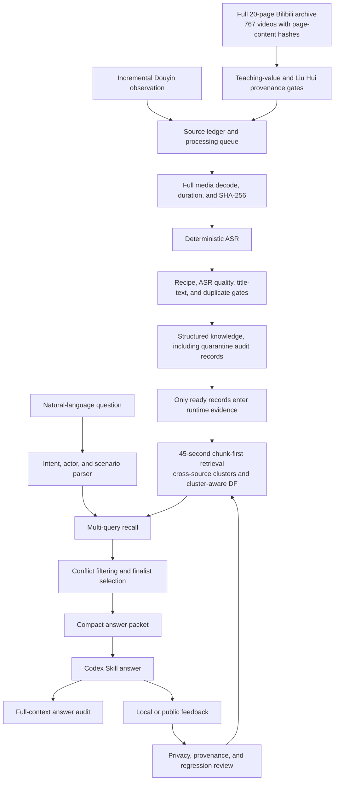

# Badminton Skills Coach

[](https://github.com/MuyuanGuo/badminton-skills-coach/actions/workflows/validate.yml)
[](https://github.com/MuyuanGuo/badminton-skills-coach/releases/latest)
[](LICENSE)


An evidence-grounded RAG and knowledge-engineering project for Codex. It turns public Chinese badminton coaching videos into searchable, citable, regression-tested diagnostics, practice plans, and video evidence.

> You are viewing the `develop` branch. The current development version is **2.0.0-dev.1** and its release status is **unreleased**. For user-facing stable documentation, see [`main`](https://github.com/MuyuanGuo/badminton-skills-coach/tree/main). Installable packages are published through [Releases](https://github.com/MuyuanGuo/badminton-skills-coach/releases/latest).

[Evaluation report](https://muyuanguo.github.io/badminton-skills-coach/evaluation/) · [Stable website](https://muyuanguo.github.io/badminton-skills-coach/en/) · [中文](README.md) · [Contributing](CONTRIBUTING.md)

This is an independent project. It is not authored, operated, or endorsed by Liu Hui.

## Why this project matters

A conventional “keyword search plus LLM summary” pipeline fails in predictable ways:

1. It retrieves a neighboring but incorrect technique, such as forehand evidence for a backhand question.
2. It presents titles, tags, or model priors as claims explicitly supported by the source.
3. It scores well offline while real answers, incremental data, and release artifacts remain irreproducible or unauditable.

This project turns those failure modes into independently testable engineering constraints:

- Parse technique, actor, court zone, discipline, pressure state, and event sequence before retrieval.
- Recall broadly, then apply conflict filters, hard-negative exclusions, and finalist selection.
- Ground specific claims in teaching notes, reviewed evidence atoms, or timestamped transcript windows.
- Give the model a compact `answer_packet` while retaining a SHA-256-bound full context for final audit.
- Run data updates, evaluation, artifact synchronization, and release verification through deterministic scripts and CI gates.
- Admit feedback into ranking or regression only after privacy, provenance, and review checks.

The result is more than a useful Skill: it is an end-to-end production system for turning unstructured video into auditable AI output.

## What changed in the 2.0 development line

### Evidence boundaries, not “retrieved means relevant”

Titles and keywords are recall signals only. The answer layer may cite only the current turn’s `V1...Vn` sources and stable `evidence_id` values. Handedness, court zone, singles or doubles, active or passive state, and player/partner/opponent roles are structured constraints rather than soft prompt instructions.

### Closed-loop quality, not one accuracy score

The evaluation surface covers:

- Query interpretation, action scope, actor relationships, and clarification continuity.
- Candidate recall, finalist selection, primary-source coverage, and hard-negative exclusion.
- Multi-source growth uses dual-track retrieval evaluation: the all-source production rank is observed as-is, while a stable-source view remains comparable with the released baseline; unjudged new-source exposure has a separate anti-flood budget.
- Claim-level evidence, confidence boundaries, answer completeness, and citation consistency.
- Metamorphic language robustness, feedback-transfer privacy, historical blind tests, and current-runtime generation review.
- Latency, peak memory, and answer-packet size budgets.

### Recoverable data engineering

An incremental update does not overwrite generated artifacts optimistically. The full pipeline snapshots prior state, rebuilds knowledge, indexes, queues, graphs, and packaged references, and rolls back every touched artifact if a test or quality gate fails. A successful run emits a local impact report covering status transitions, retrieval changes, evidence-source deltas, queue deltas, and build identity.

### Token and runtime cost

The model reads a compact evidence packet instead of full retrieval diagnostics, duplicated policy prose, and every candidate. Evidence windows are stored once and referenced by `window_id` from claims, atoms, and videos. The budget requires at least a 50% reduction, a P95 no larger than 12 KiB, and a hard per-packet maximum of 16 KiB.

## Verifiable results

| Metric | Current baseline |
| --- | ---: |
| Processed public videos | 1242 |
| Bilibili full provenance archive | 767: 57 answer-ready, 710 automatically isolated, 0 pending |
| Ready teaching videos | 411 |
| Transcript-backed evidence | 392 |
| Reviewed visual-summary fallbacks | 19 |
| Maintainer-reviewed answer cases | 57/57 |
| Query-understanding cases | 143/143 |
| Metamorphic language variants | 30/30 |
| Hard-negative selections | 0 of 194 |
| Latest independently reviewed generations | 3/3; new runtime review pending |
| Promoted public feedback signals | 0 |

All 3,527 transcript evidence items have timestamps. The zero public-feedback count is intentional: the machine-enforced lifecycle is ready, but the project does not invent real user data.

The balanced performance gate covers five question types. In the latest local acceptance run, search P95 was `77.75 ms`, answer-context P95 was `712.04 ms`, traced peak memory was `80.15 MB`, and the answer packet averaged a `71.22%` reduction. These are development-machine measurements, not cross-platform performance promises.

See the [evaluation report](https://muyuanguo.github.io/badminton-skills-coach/evaluation/) for the latest generation snapshot with completed independent human review. The deterministic regression and performance gates above describe this branch; generation review for the new runtime remains pending independent human review.

## Architecture


```mermaid
flowchart TD
    A1["Incremental Douyin observation"] --> B["Source ledger and processing queue"]
    A2["Full 20-page Bilibili archive<br/>767 videos with page-content hashes"] --> O["Teaching-value and Liu Hui provenance gates"]
    O --> B
    B --> C["Full media decode, duration, and SHA-256"]
    C --> D["Deterministic ASR"]
    D --> P["Recipe, ASR quality, title-text, and duplicate gates"]
    P --> E["Structured knowledge, including quarantine audit records"]
    E --> R["Only ready records enter runtime evidence"]
    R --> F["45-second chunk-first retrieval<br/>cross-source clusters and cluster-aware DF"]
    Q["Natural-language question"] --> G["Intent, actor, and scenario parser"]
    G --> H["Multi-query recall"]
    F --> H
    H --> I["Conflict filtering and finalist selection"]
    I --> J["Compact answer packet"]
    J --> K["Codex Skill answer"]
    K --> L["Full-context answer audit"]
    K --> M["Local or public feedback"]
    M --> N["Privacy, provenance, and regression review"]
    N --> F
```

A new transcript does not update model weights or become Codex conversational memory. It can affect an answer only after passing provenance, media-integrity, transcription-recipe, ASR-quality, title-to-text, evidence-extraction, and duplicate gates; becoming a `processing_status: ready` knowledge record; passing index, regression, canary, and packet-budget checks; and being installed with the Skill. Even then, it affects only a question whose current retrieval selects a relevant chunk. A raw `.json`, `.srt`, or `.txt` file alone changes no answer.

Primary runtime path:

```text
query
  -> prepare_answer_context.py
  -> question_interpretation
  -> retrieval queries
  -> candidate conflict checks
  -> selected_videos
  -> answer_plan + claim_evidence_map
  -> answer_packet
  -> generated answer
  -> audit_answer.py
```

`search_knowledge.py` is the low-level retrieval and diagnostic layer. `prepare_answer_context.py` is the answer-orchestration boundary. Keeping them separate prevents callers from bypassing intent parsing, completeness contracts, and final evidence selection.

## Key engineering decisions

### Data and evidence layers

- `data/knowledge/douyin_knowledge_base.json`: backward-compatible path for the unified multi-source knowledge base and processing state.
- `data/knowledge/bilibili_knowledge_base.json`: Bilibili build output admitted through origin, transcript-quality, and cross-platform duplicate gates.
- `data/bilibili_video_index.json`: Bilibili metadata index for the 大G羽毛球 space.
- `data/processing/bilibili_origin_review_queue.json`: candidates isolated by the automatic provenance gate; it is a machine-audit ledger rather than a mandatory human-review backlog.
- `data/processing/bilibili_queue.json`: media, transcription, and knowledge-build state for records that passed the origin gate.
- `references/knowledge-base.json`: compact runtime evidence shipped with the Skill.
- `retrieval-index.json`: retrieval data without full transcript bodies.
- `reviewed-evidence-atoms.json`: closed, reviewed claims for covered scopes.
- Original media, full transcripts, temporary CDN URLs, cookies, and local feedback stay out of Git.

`automatic_transcript`, `reviewed_transcript`, and `visual_reviewed` keep provenance explicit. Automated ASR is not mislabeled as human-reviewed fact, and synthesized principles are not presented as verbatim source claims.

The Bilibili path separates teaching value from content origin. Teaching cards that name Liu Hui become candidates only; teaching videos without an origin signal are isolated as uploader-original or unknown-origin content. Bilibili SEO descriptions append biography and related-video text, so they are forbidden as provenance evidence. In unattended mode, admission requires the uploader identity, publisher-authored text naming Liu Hui, a dedicated origin tag, and valid media metadata together. This is auditable publisher-declared evidence, not an independent copyright determination. Conflicts or missing signals terminate in quarantine and never enter the answer pool.

When one record fails provenance, transcription, title-to-text, automatic-evidence, or duplicate gates, its audit state is retained but it remains non-`ready`, and no transcript segments are packaged for runtime use. A cross-artifact invariant, stable-corpus regression, or release-gate failure instead rolls back the generated artifacts for that run. Neither failure class silently enters retrieval or the answer pool, and neither is disguised as a mandatory human-review backlog.

### Answer contract

The answering model consumes, in order:

1. `question_interpretation`: target action, actors, scenario, exclusions, and event sequence.
2. `boundary`: coverage limits that must be disclosed.
3. `answer_plan`: allowed claims for each answer branch.
4. `claim_evidence_map`: claim-level support and confidence ceilings.
5. `selected_videos`: the only sources that may be cited.
6. `feedback_prompt`: feedback labels bound to the current `V1...Vn` mapping.

Canonical JSON SHA-256 binds the compact packet to the complete context, preventing the model’s evidence input from drifting away from the audited object.

### Feedback and privacy

Local feedback remains on the user’s machine by default. Public feedback requires separate sanitization and sharing consent. Promotion verifies source-body hashes, private-field exclusion, lifecycle state, provenance revalidation, and adversarial transfer cases. Feedback can identify errors, but it never becomes badminton truth by itself.

### Incremental updates and transactions

```text
incremental observation
  -> source classification and cross-platform deduplication
  -> download/transcription
  -> evidence-quality checks
  -> knowledge and index rebuild
  -> regression and performance gates
  -> impact report
  -> pull request
```

Generated artifacts use atomic writes, while full updates use a multi-file rollback guard. The impact report enforces parity between `ready` videos and the retrieval index and blocks unexplained removal of ready evidence.

## Testing and delivery discipline

The `validate` workflow includes:

- Static and unit tests on Python 3.10 and 3.12.
- Sharded answer-context regressions.
- Quality reporting, feedback-lifecycle, metamorphic, and performance gates.
- Skill-reference synchronization, reproducibility, link, DOM, and release-artifact checks.
- CodeQL, deterministic ZIP packaging, SHA-256, CycloneDX SBOM, and GitHub Artifact Attestation.

Core local entry points:

```bash
python3 scripts/doctor.py
python3 scripts/validate_project.py
python3 scripts/run_ci_tests.py fast
python3 scripts/run_ci_tests.py artifacts
python3 scripts/run_ci_tests.py context
python3 scripts/run_full_update_pipeline.py
```

`run_bilibili_update_pipeline.py` is the resumable entry point for Bilibili updates. A full archive must reconcile the reported profile total, contiguous pages, and per-page BVID content hashes. Audio reaches ASR only after complete PyAV decoding, duration checks, and SHA-256 verification. Per-video checkpoints are followed by duration-scaled ASR QC, title-to-transcript consistency, B-B and B-Douyin deduplication, 45-second chunk construction, mechanical wiring canaries, stable-corpus regressions, performance budgets, and packet-size gates. An item failure retains its checkpoint and is retried or terminally isolated according to policy; a generation-level gate failure rolls back that run's generated artifacts.

After interruption, do not reconstruct the subcommands manually. Re-run the same complete recovery command: valid checkpoints are skipped, and installation occurs only after the full archive is terminal and the build and release gates pass.

```bash
python3 scripts/run_bilibili_update_pipeline.py --install
```

A successful release stage writes local `output/update-impact-report.json`; a failed release stage restores generated artifacts.

## How to review this project quickly

For recruiters and technical interviewers:

1. Read “Key engineering decisions” above for the problem decomposition and boundaries.
2. Inspect [`prepare_answer_context.py`](skills/liuhui-badminton-coach/scripts/prepare_answer_context.py) and [`audit_answer.py`](skills/liuhui-badminton-coach/scripts/audit_answer.py).
3. Inspect positives, hard negatives, and forbidden claims in [`answer_quality_cases.json`](data/evaluation/answer_quality_cases.json).
4. Open the [evaluation report](https://muyuanguo.github.io/badminton-skills-coach/evaluation/).
5. Review transaction boundaries and quality gates in [`run_full_update_pipeline.py`](scripts/run_full_update_pipeline.py).
6. Review cross-version validation and security analysis in [GitHub Actions](https://github.com/MuyuanGuo/badminton-skills-coach/actions).

## Repository map

```text
skills/liuhui-badminton-coach/   Installable Skill, runtime scripts, compact references
data/                            Source ledger, queues, knowledge builds, evaluation data
config/                          Classification, retrieval, answer, feedback, performance rules
scripts/                         Incremental processing, builds, evaluation, validation, release
docs/                            User-facing website and deterministic evaluation report
output/                          Knowledge graphs, review queues, local impact reports
```

## Branch and version model

- Current branch: `develop`
- Current development version: `2.0.0-dev.1`
- Release status: `unreleased`
- Current stable release: `main` / `v1.5.0`

The `develop` README targets recruiters, technical interviewers, and contributors by emphasizing design decisions and verifiable evidence. The `main` README and GitHub Pages target users with installation, prompting guidance, and stable behavior.

To release `2.0.0`, all gates must pass on `develop`, followed by a pull request into `main`, a stable-channel metadata switch, and a `v2.0.0` Release. Development metadata must never imply that 2.0.0 is already published.

## Technology and boundaries

Python 3, Codex Skills, JSON rules and generated artifacts, faster-whisper, PyAV, yt-dlp, Chrome DevTools Protocol, BM25/character n-grams, SimHash/Jaccard content clustering, Node.js, Draw.io/Mermaid, and GitHub Actions.

Original software and automation use the [MIT License](LICENSE). Third-party video, audio, creator names, titles, thumbnails, transcripts, and other source material are not covered by that grant; see [NOTICE](NOTICE). See [SECURITY.md](SECURITY.md) for security reporting and [RELEASE_SECURITY.md](RELEASE_SECURITY.md) for build verification.
