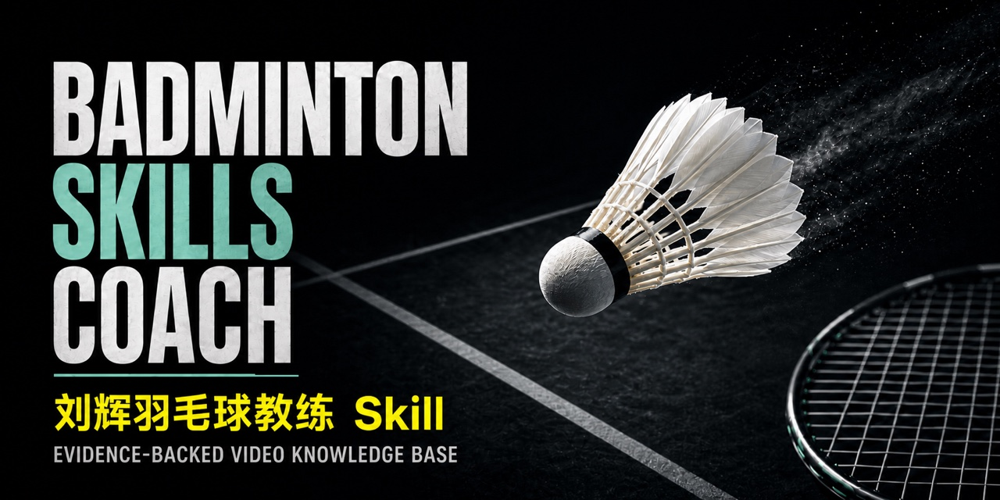

# Badminton Skills Coach

An evidence-backed badminton coaching Skill for Codex. Describe a real technique, footwork, tactics, equipment, or practice problem and it returns a diagnosis, actionable practice, relevant Douyin and Bilibili videos, timestamps, and explicit evidence boundaries.

[Install 2.1.3](#install) · [Ask better questions](#ask-better-questions) · [Project website](https://muyuanguo.github.io/badminton-skills-coach/en/) · [Report answer feedback](https://github.com/MuyuanGuo/badminton-skills-coach/issues/new?template=skill-feedback.yml) · [中文 README](README.md)

**Version 2.1.3 is the stable release** on `main` and [v2.1.3](https://github.com/MuyuanGuo/badminton-skills-coach/releases/tag/v2.1.3); ongoing work continues on `develop`. This independent project is not authored, operated, endorsed, or approved by Liu Hui or the source publishers.

## Start in 30 seconds

Install the Skill, restart Codex, and describe the situation:

~~~text
$liuhui-badminton-coach I am an intermediate doubles player.
Smashes into my backhand hip make my block sit up.
Separate racket-face, contact-point, and movement problems, then give me
a 20-minute partner drill.
~~~

The Skill reconstructs who did what, the incoming shot, and the requested action before retrieving evidence. Every displayed source has a turn-scoped V label, a stable evidence_id, a canonical link, and a timestamp when available.

## What changed in 2.1.3

- One answer-ready corpus now combines processed Douyin and Bilibili teaching material across strokes, full-court movement, singles and doubles tactics, net skills, serve/receive, equipment, and practice.
- Titles and keywords recall candidates but cannot prove a technical claim. Source, transcript, evidence-quality, and duplicate gates decide whether a video may answer.
- 784 primary sources lead. 175 bounded supplemental sources may fill a concept, condition, drill, or equipment gap only through matched timestamp windows.
- “One to three videos” is a per-claim evidence cap, not a three-video answer cap. Materially different subquestions or scenario branches may expose more sources; simple answers are never padded with duplicates.
- Local feedback stays on the user's machine by default and affects personalization only after confirmation. Public feedback requires separate sanitization, consent, source verification, and regression tests.
- The model reads a compact answer packet while the complete context remains authoritative for final audit; canonical JSON SHA-256 binds the two.
- Runtime review priors live in a separate registry from `data/evaluation/answer_quality_cases.json`; evaluation scripts default to unassisted retrieval mode so gold cases cannot silently feed the reported metric.
- A 51.7 MiB read-only SQLite evidence store lazily reads mappings, sequences, and chunks instead of retaining duplicate full JSON projections at cold start; Linux cold-start RSS has a 128 MiB hard budget.
- Python 3.10 and 3.12 use the same hash-locked maintenance dependencies, while generated artifacts, logical SQLite content, and canary hashes remain reproducible across environments.
- Release answers are deterministically rebuilt for every critical case, bound to complete and answer-semantic runtime fingerprints, reproduced byte for byte, and re-audited against full context by the tag workflow.

## Answer-completeness hardening on `develop`

- Compound questions now preserve both source units and evidence units. Delivery instructions such as plans, check orders, and conditional branches are no longer searched as standalone technical questions.
- Elliptical later units and mixed technical/delivery units inherit side, shot family, court zone, discipline, and other root scenario constraints while preserving explicit branch overrides such as direction; independently scoped questions remain isolated.
- Answer packet v4 adds a typed `delivery_contract`. Exact minutes, three-day correction, two-week consolidation, success criteria, diagnostic comparisons, ordered checks, and tactical direction branches are independent required items.
- The renderer produces each item and the auditor validates its internal semantics; a Q/D marker or raw source excerpt alone no longer satisfies a compound request.
- The live release gate expands from three historical cases to those three plus diagnosis, practice, and tactics delivery cases, with deletion negative controls for every required delivery block.

## Current evidence and quality baseline

| Metric | Current baseline |
| --- | ---: |
| Processed public videos | 1248 |
| Bilibili full source catalog | 767: 599 answer-ready, 168 policy-excluded or quality-isolated, 0 pending |
| Ready teaching videos | 959 |
| Primary / bounded supplemental evidence | 784 / 175 |
| Transcript-backed evidence | 766 |
| Bounded timestamp-window evidence | 174 |
| Reviewed visual-summary fallbacks | 19 |
| Maintainer-reviewed answer cases | 57/57 |
| Query-understanding cases | 145/145 |
| Metamorphic language variants | 30/30 |
| Hard-negative selections | 0 of 194 |
| Current-runtime reproducible release answers | 20/20 |
| Promoted public feedback signals | 0 |

All 7,754 transcript evidence items have timestamps. These figures describe the controlled corpus and evaluation set; they do not claim that every possible natural-language question has already been tested.

## Install

Daily use requires Python 3.10 or newer. It does not require an OpenAI API key or transcription dependencies.

~~~bash
curl --fail --show-error --location --retry 3 https://github.com/MuyuanGuo/badminton-skills-coach/releases/download/v2.1.3/liuhui-badminton-coach-2.1.3.zip \
  -o /tmp/liuhui-badminton-coach-2.1.3.zip
curl --fail --show-error --location --retry 3 https://github.com/MuyuanGuo/badminton-skills-coach/releases/download/v2.1.3/SHA256SUMS.txt \
  -o /tmp/SHA256SUMS.txt
curl --fail --show-error --location --retry 3 https://github.com/MuyuanGuo/badminton-skills-coach/releases/download/v2.1.3/SBOM.cdx.json \
  -o /tmp/SBOM.cdx.json
(cd /tmp && shasum -a 256 -c SHA256SUMS.txt)
install_dir="$(mktemp -d)"
unzip -q /tmp/liuhui-badminton-coach-2.1.3.zip -d "$install_dir"
python3 "$install_dir/liuhui-badminton-coach/scripts/install.py"
~~~

Verify the installation:

~~~bash
python3 ~/.codex/skills/liuhui-badminton-coach/scripts/doctor.py
~~~

Restart Codex after installation. Re-running the installer safely upgrades the installed Skill after validating the package.

Windows PowerShell uses the same release and SHA-256 verification:

~~~powershell
$v = "2.1.3"; $base = "https://github.com/MuyuanGuo/badminton-skills-coach/releases/download/v$v"
Invoke-WebRequest "$base/liuhui-badminton-coach-$v.zip" -OutFile "$env:TEMP/liuhui-badminton-coach-$v.zip"
Invoke-WebRequest "$base/SHA256SUMS.txt" -OutFile "$env:TEMP/SHA256SUMS.txt"
$expected = ((Select-String "liuhui-badminton-coach-$v.zip" "$env:TEMP/SHA256SUMS.txt").Line -split '\s+')[0]
$actual = (Get-FileHash "$env:TEMP/liuhui-badminton-coach-$v.zip" -Algorithm SHA256).Hash.ToLower()
if ($actual -ne $expected) { throw "SHA-256 mismatch" }
$stage = Join-Path $env:TEMP "liuhui-skill-install"; Expand-Archive "$env:TEMP/liuhui-badminton-coach-$v.zip" $stage -Force
python "$stage/liuhui-badminton-coach/scripts/install.py"
~~~

## Ask better questions

Useful details include:

- Your level and whether the situation is singles or doubles.
- Incoming shot, court area, forehand/backhand side, and active/passive state.
- What you currently do and the symptom you observe.
- The action, tactical outcome, or training goal you want.
- Whether you practice alone, with a partner, or with a coach, plus session length.

Chinese questions usually retrieve more precisely because the source videos and evidence notes are primarily Chinese.

Without a continuous video of your movement, the Skill can provide an evidence-backed diagnostic order but cannot confirm one unique cause. It does not provide medical diagnosis, performance guarantees, generic shopping recommendations, or impersonation of Liu Hui.

## Why an answer may show more than three videos

The one-to-three limit applies to evidence for a single claim. A simple question normally needs only a few sources. A complex question may need more when separate strokes, singles/doubles branches, technique and footwork subproblems, or complementary evidence roles are materially different.

Only videos in the final answer packet are displayed, exactly once each, with contiguous V1…Vn labels ordered by usefulness. Content-cluster deduplication, claim-level evidence gates, and a 16-finalist hard ceiling prevent redundant or uncontrolled expansion.

## Feedback and privacy

Every answer ends with a prompt tailored to its current labels, for example:

~~~text
V2 was most useful; V4 was irrelevant; claim 2 is wrong;
the answer missed “how to handle the passive situation”;
you misunderstood me—I meant “singles kill-to-net.”
~~~

Explicit feedback first enters a local pending-review queue. It affects personalization only after the user confirms the parsed record. The recorder preserves the exact turn-scoped mapping; sparse labels from an older answer such as V2, V3, and V5 are never silently renumbered or rebound to different videos.

To share sanitized public feedback, use the [Skill feedback Issue template](https://github.com/MuyuanGuo/badminton-skills-coach/issues/new?template=skill-feedback.yml). A signal can enter the public Skill only after consent, provenance verification, privacy checks, and regression testing. Feedback is never treated as badminton source truth by itself.

## Sources and boundaries

The repository does not ship original media, raw transcript directories, temporary cookies, platform credentials, model caches, or local user feedback. The installable archive contains only derived indexes and locatable evidence data required at runtime. Original software and documentation use the [MIT License](LICENSE); third-party video, audio, titles, creator names, thumbnails, and transcripts are outside that grant. See the [Data and Source-Material Notice](LICENSE-DATA) and [NOTICE](NOTICE).

Maintenance batches download, transcribe, and validate without committing or pushing by default. Publishing requires explicit `--commit --push`, and only an artifact allowlist may be staged.

### How new data reaches an answer

~~~mermaid
flowchart LR
    B["Source admission and media validation"] --> C["Decodable media"]
    C --> D["Deterministic ASR"]
    D --> P["Recipe, ASR quality, source-safety, and duplicate hard gates"]
    P --> E["Structured knowledge, including quarantine audit records"]
    E --> A["Answer admission layers: primary / supplemental / none"]
    A --> S["Read-only SQLite runtime evidence store"]
    S --> F["45-second chunk-first plus bounded-window retrieval"]
    F --> R["Answer packet and final audit"]
~~~

A new transcript does not update model weights or become Codex conversational memory. A raw `.json`, `.srt`, or `.txt` file alone changes no answer. A fully aligned record becomes `primary`; a record with direct teaching windows but narrower metadata or scope becomes `supplemental`. When provenance, safety, transcript quality, or duplicate gates fail, audit state is retained with `answer_eligibility: none`; only a generation-level consistency failure will still roll back the generated artifacts for that run.

Maintainers resume an incomplete Bilibili pipeline through one recovery entry point:

~~~bash
python3 scripts/run_bilibili_update_pipeline.py --install
~~~

Runtime boundaries and module-loading constraints are documented in [ARCHITECTURE.md](ARCHITECTURE.md). For maintenance and contributions, see [CONTRIBUTING.en.md](CONTRIBUTING.en.md) ([中文](CONTRIBUTING.md)). Release verification, signed tags, and SBOM guidance live in [RELEASE_SECURITY.md](RELEASE_SECURITY.md). Documentation on every branch must describe that branch's actual code, not an unreleased design.

- Stable release: `main` / `v2.1.3`
- Installable package: [v2.1.3](https://github.com/MuyuanGuo/badminton-skills-coach/releases/tag/v2.1.3)

`main` is the stable release source and `develop` is the integration branch. Both use the same evidence and governance standards, while their README and version metadata must reflect their distinct states.
