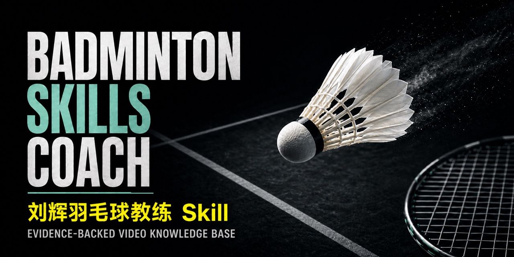
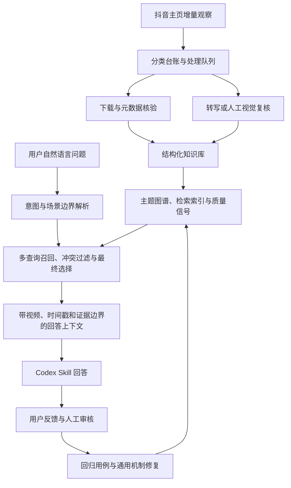

# Badminton Skills Coach

[](https://github.com/MuyuanGuo/badminton-skills-coach/actions/workflows/validate.yml)
[](https://github.com/MuyuanGuo/badminton-skills-coach/releases/latest)
[](LICENSE)



面向 Codex 的证据驱动羽毛球教练 Skill：把公开教学视频变成可检索、可引用、可回归验证的训练建议，并给出值得观看的视频、时间戳和证据边界。

[安装最新版](#安装稳定版) · [查看实际回答](#实际回答示例) · [项目网站](https://muyuanguo.github.io/badminton-skills-coach/) · [提交回答反馈](https://github.com/MuyuanGuo/badminton-skills-coach/issues/new?template=skill-feedback.yml) · [English](README.en.md)

这是 **1.2.0 稳定版**。GitHub `main` 分支和 [`v1.2.0` Release](https://github.com/MuyuanGuo/badminton-skills-coach/releases/tag/v1.2.0) 提供当前正式版本；`develop` 用于后续增量维护。本项目不是刘辉本人，也不代表其个人观点或背书。

## 30 秒了解它

安装稳定版并重启 Codex 后，直接描述比赛或训练中的真实问题：

```text
$liuhui-badminton-coach 我后场已经被动，来不及正常架拍，
怎样把球回到底线？请区分正手头顶和反手处理，并给训练方法。
```

Skill 会先拆分场景与动作边界，再从已审核教学证据中选择视频；文字负责诊断和训练安排，视频负责展示空间动作。没有动作视频时，它会给排查顺序，但不会假装确认你的实际动作。

## 实际回答示例

下面是维护者审核用例 `AQ001` 的精简展示，原始评测保存了完整回答、视频映射和禁用结论：

> **问题：** 后场被动来不及架拍，怎么把球打到底线？
>
> **诊断摘要：** 真正被动时不要硬补主动球的大架拍和完整侧身。拍子应更早从身体下方让到身后；击球点越低、越靠后，准备和挥拍幅度也要相应缩短，但拍速和力量传递不能丢。
>
> **训练重点：** 先做“正常准备 → 听到被动指令 → 球拍从下方到身后 → 向上击球”的无球转换，再由陪练从半被动逐渐增加来球深度。每球只检查判断是否及时、框架是否匹配击球点、缩短动作后拍速是否仍然充分。
>
> **证据示例：** [正手被动高远](https://www.douyin.com/video/7558912953539071292)，重点看 `00:27–00:40` 从下方到身后的引拍路线，以及 `01:54–02:03` 提前击球。

完整回答还会区分正手头顶与反手被动、列出置信边界，并为每个引用视频提供稳定 `evidence_id` 和观看重点。

## 项目亮点

- **证据边界优先的 RAG**：视频标题和关键词只用于召回，具体技术结论必须落到教学笔记或带时间戳的转写窗口。
- **从原始来源到 Skill 的完整流水线**：增量发现、分类、下载、转写、质量审核、知识库重建、索引生成、问答验证和发布均可脚本化运行。
- **意图与场景约束**：保留正手/反手、前后场、单双打、主动/被动、目标动作、事件链和角色关系，减少相邻技术串线。
- **反馈闭环**：本地反馈和 GitHub Issue 使用同一审核模型；确认后的错误会进入评测集，优先修复通用机制，而不是堆叠关键词补丁。
- **可审计输出**：回答只引用当前轮次分配的 `V1...Vn` 标签、稳定 `evidence_id` 和规范链接，拒绝未审核或证据不足的视频。

## 规模与当前基线

| 指标 | 当前值 | 说明 |
| --- | ---: | --- |
| 已处理公开视频 | 474 | 来源处理记录，不等同于全部教学内容 |
| 可用于回答的教学视频 | 353 | 仅 `processing_status: ready` 可进入证据池 |
| 转写证据 | 334 | 通过转写质量门禁 |
| 视觉复核兜底 | 19 | 无法可靠依赖语音时使用人工摘要 |
| 回答质量黄金用例 | 57/57 | 已维护者审核，含文本、边界、视频和禁用结论 |
| 上下文评测 | 1.0 | 候选召回、选中召回、核心视频命中率均为当前基线 |
| 硬负例误选 | 0 | 当前回归集中的不相关视频未被选中 |
| 前向盲测 | 3/3 | 两轮共 8 条未见问法连续通过 |
| 公共反馈信号 | 0 | 尚无真实 GitHub 反馈被晋升 |

上下文指标衡量的是问题理解、证据候选和最终视频选择，不等同于所有自然语言回答都已经人工审核。真实用户反馈仍是发现新错误类型的主要入口。

## 系统架构



运行时入口是 `skills/liuhui-badminton-coach/scripts/prepare_answer_context.py`。它先解析意图和边界，再做多查询召回、场景冲突过滤、候选合并、最终选择和证据窗口定位；低层 `search_knowledge.py` 只用于诊断，不应替代该入口。

## 技术设计

### 证据模型

- `data/knowledge/douyin_knowledge_base.json` 是构建产物，保存视频状态、教学笔记、转写质量、主题和稳定链接。
- `references/knowledge-base.json`、`retrieval-index.json`、`topic-map.json` 是随 Skill 发布的运行时副本。
- `curated`、`reviewed_transcript`、`visual_reviewed` 表示不同证据强度；自动转写不是人工事实。
- 具体结论必须有直接教学证据。标题、标签、主题归属和 n-gram 命中只能作为导航或召回线索。
- 临时 CDN 地址、原始媒体、完整转写和本地用户反馈不进入 Git。

### 问答编排

每个问题只从一次 `prepare_answer_context.py` 结果开始回答，按以下顺序读取：

1. `question_interpretation`：确认正向意图、排除项、症状、事件链和拆分问题。
2. `boundary`：先声明证据边界和适用条件。
3. `answer_guidance`：决定文字和视频的分配方式。
4. `feedback_guidance`：只把已确认反馈用于排序和重新规划，不把反馈当作教学事实。
5. `selected_videos`：这是唯一可以引用的视频集合。
6. `answer_contract`：按当前回答动态生成 `V1...Vn` 反馈提示。

这套边界专门防止“反手被动高远”召回正手内容、把发球问题交给后场击球视频，或把“杀球后来不及上网”降级成无关的泛网前步法。

## 使用 Skill

### 安装稳定版

```bash
curl -L https://github.com/MuyuanGuo/badminton-skills-coach/releases/download/v1.2.0/liuhui-badminton-coach-v1.2.0.zip \
  -o /tmp/liuhui-badminton-coach-v1.2.0.zip
curl -L https://github.com/MuyuanGuo/badminton-skills-coach/releases/download/v1.2.0/SHA256SUMS.txt \
  -o /tmp/SHA256SUMS.txt
(cd /tmp && shasum -a 256 -c SHA256SUMS.txt)
install_dir="$(mktemp -d)"
unzip -q /tmp/liuhui-badminton-coach-v1.2.0.zip -d "$install_dir"
python3 "$install_dir/liuhui-badminton-coach/scripts/install.py"
```

安装后运行：

```bash
python3 ~/.codex/skills/liuhui-badminton-coach/scripts/doctor.py
```

重新启动 Codex 后使用：

```text
$liuhui-badminton-coach 我是业余中级双打选手。对手杀到反手身体附近时，
我挡网的拍面容易翻，回球经常冒高。请诊断原因，并给一个有陪练、每次 20 分钟的训练方案。
```

### 如何提问效果最好

推荐自然描述以下信息：

`水平 + 单打/双打 + 来球与场区 + 当前处理 + 具体症状 + 想改善的目标 + 训练条件`

尤其适合：

- 指定动作或变体：反手被动高远、遁地炮、杀上网、接杀挡网、双打接发。
- 带因果链的诊断：“我杀球后经常来不及接下一拍网前球，单打应该怎样启动？”
- 有明确条件的对比：“正手和反手被动高远在来不及架拍时分别怎么处理？”
- 可执行的训练设计：说明是否独练、是否有陪练、每次可用时长和当前水平。

宽泛问题只能得到宽泛证据；没有动作视频时，Skill 可以给症状排查顺序，但不能确认实际动作。它不用于医学诊断、效果保证、泛器材推荐或冒充刘辉本人。

## 评测与质量门禁

快速检查：

```bash
python3 scripts/doctor.py
python3 scripts/validate_project.py
PYTHONPATH=scripts python3 -m unittest discover -s scripts -p 'test_*.py'
```

回答相关变更至少运行：

```bash
python3 scripts/evaluate_answer_quality.py
python3 scripts/evaluate_answer_context.py
python3 scripts/evaluate_forward_test_results.py
python3 scripts/evaluate_query_understanding.py
python3 scripts/evaluate_query_equivalence.py
```

完整构建与验证：

```bash
python3 scripts/run_full_update_pipeline.py
python3 scripts/validate_project.py
```

每次质量迭代都要同时检查：

- 正确候选是否被召回并进入最终集合。
- 反例、相邻动作和不同角色的视频是否被排除。
- 文本结论是否有直接证据，视频说明是否有观看重点。
- 至少两轮此前未入库的问法是否连续通过。
- 运行时指纹、审核维度和证据摘要是否被保存。

当前评测验证的是“可证据化的回答上下文”和维护者审核的答案快照。真实回答审计还需要保存原问题、完整回答、视频映射及人工指出的错误，不能只看检索分数。

## 反馈与回归闭环

每次回答末尾都会提供当前轮次可用的反馈格式，例如：

```text
V2 不相关；第 2 点结论不对；回答漏了“被动情况下如何处理”。
你理解错了，我真正问的是“被动后场如何尽快完成架拍”。
```

维护者处理真实错误时必须保留：原问题、Skill 完整回答或出错片段、当前 `V` 映射、稳定 `evidence_id` 和具体错误。先确认现有评测为什么没发现，再判断是意图、边界、证据、排序还是回答表达问题；新错误类型要先扩展评测，再修通用机制和回归案例。

本地反馈：

```bash
python3 skills/liuhui-badminton-coach/scripts/feedback.py list --status pending_review
python3 skills/liuhui-badminton-coach/scripts/feedback.py review \
  --feedback-id FEEDBACK_ID \
  --decision accepted \
  --note "已核对问题、视频和来源证据"
```

GitHub 反馈请使用 [Skill feedback Issue 模板](https://github.com/MuyuanGuo/badminton-skills-coach/issues/new?template=skill-feedback.yml)，只提交用户确认可以公开的脱敏内容。公共信号只有在来源、隐私、人工核证和回归测试均通过后才会晋升。

## 数据更新与维护

维护侧入口：

```text
scripts/check_douyin_updates.py          增量主页观察与入队
scripts/process_douyin_ready_batch.py   下载、转写、重建和质量门禁
scripts/run_full_update_pipeline.py     规则/笔记修改后的全量重建
scripts/doctor.py                       环境与路径诊断
scripts/validate_project.py             项目完整性验证
scripts/package_skill_release.py        Skill 打包与校验和
scripts/generate_release_sbom.py        CycloneDX 文件级 SBOM
```

新视频使用增量快照 `data/tmp/douyin_profile_incremental_snapshot.json`，它只记录本次观察到的近期卡片，不是完整主页归档。新视频的标准流程是：

```text
增量检查 -> 分类复核 -> 入队 -> 下载/转写 -> Review notes -> 知识库重建 -> 评测 -> PR
```

只修改规则、笔记或知识库结构时运行：

```bash
python3 scripts/run_full_update_pipeline.py
```

维护贡献请从 `develop` 创建短生命周期分支，提交与风险匹配的回归用例，不提交原始媒体、完整转写、临时 Cookie、模型缓存或用户本地反馈。详细约定见 [CONTRIBUTING.md](CONTRIBUTING.md)。

## 分支与发布模型

- 稳定版：`main` / `v1.2.0`
- 当前分支：`main`
- 发布状态：`stable`
- `develop`：下一版本的技术开发基线，README 使用 `unreleased` 文案。
- `v1.2.0`：当前正式 Release；develop 上的实验性规则和未发布评测不代表稳定版行为。

发布前必须在 `develop` 完成完整门禁，再通过 `develop -> main` 的发布 PR 更新版本号、构建产物和 README。发布后的紧急修复可以直接走小范围 PR，但下一轮开发仍需同步回 `develop`。

## 仓库结构

```text
skills/liuhui-badminton-coach/   可安装 Skill、运行时参考文件和脚本
data/                            来源索引、队列、审核记录和评测数据
config/                          分类、检索、回答、训练与反馈规则
scripts/                         入库、重建、评测、验证和发布工具
docs/                            中英双语 GitHub Pages 项目网站
output/                          知识图谱、审核报告和可视化产物
```

核心运行时文件：

- `SKILL.md`：回答规范、证据边界和反馈协议。
- `references/knowledge-base.json`：353 条可用教学证据。
- `references/retrieval-index.json`：高召回检索索引。
- `references/answer-selection-rules.json`：意图边界、条件轴和候选选择规则。
- `scripts/prepare_answer_context.py`：唯一的问答上下文入口。

## 技术栈与边界

Python 3、Codex Skills、JSON 规则与构建产物、faster-whisper、Chrome DevTools Protocol、yt-dlp、Node.js、Draw.io/Mermaid 和 GitHub Actions。

正式 Release 使用确定性 ZIP、SHA-256、CycloneDX SBOM 和 GitHub Artifact Attestation 记录构建来源；校验方法见 [RELEASE_SECURITY.md](RELEASE_SECURITY.md)。

原创软件代码和自动化脚本采用 [MIT License](LICENSE)。第三方视频、音频、创作者名称、标题、缩略图、转写和其他来源材料不包含在 MIT 授权中，详见 [NOTICE](NOTICE)。安全问题请参阅 [SECURITY.md](SECURITY.md)。公开视频链接仅作为来源引用，使用者和贡献者应自行遵守平台规则、版权和隐私要求。
