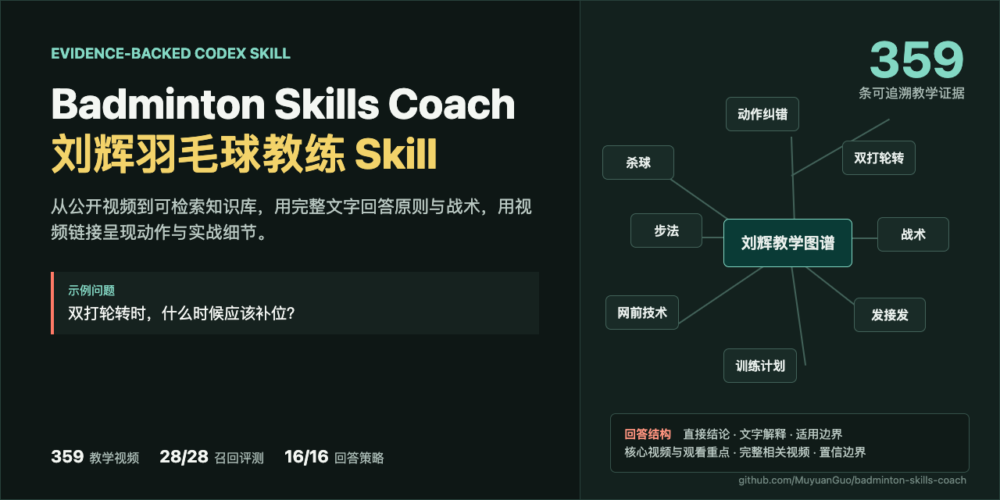

# Badminton Skills Coach / 刘辉羽毛球教练 Skill

[](https://github.com/MuyuanGuo/badminton-skills-coach/actions/workflows/validate.yml)
[](https://github.com/MuyuanGuo/badminton-skills-coach/tree/develop)
[](https://github.com/MuyuanGuo/badminton-skills-coach/tree/develop)
[](LICENSE)



`Badminton Skills Coach` 把“刘辉羽毛球”的公开抖音教学内容整理成可检索、可引用、可维护的 Codex Skill。它适合用来咨询羽毛球技术、战术、训练和纠错问题，并尽量给出对应视频、时间戳与证据边界。

你正在查看 `develop` 分支。它是持续集成分支，不代表任何稳定版本。当前开发版本是 **1.1.1-dev.1**，发布状态为 **unreleased**；普通用户请使用 `main` 或 [最新 Release](https://github.com/MuyuanGuo/badminton-skills-coach/releases/latest)。项目未获得刘辉本人授权，仅用于个人学习和知识工程实践。

## 当前状态

- 当前分支：`develop`
- 当前开发版本：`1.1.1-dev.1`
- 发布状态：`unreleased`（开发快照，不提供稳定版保证）
- 稳定版入口：[`main`](https://github.com/MuyuanGuo/badminton-skills-coach/tree/main) 和 [GitHub Releases](https://github.com/MuyuanGuo/badminton-skills-coach/releases)
- 获取到的抖音公开视频：`473` 条
- 已排除非教学/广告器材内容：`121` 条
- 已加入 Skill 知识库的教学视频：`352` 条
- 可理解证据覆盖：`352/352`（`333` 条转写证据，`19` 条视觉复核摘要兜底）
- 等待人工复核：`0` 条
- 最新入库教学视频：[4280 多点位抽球应用 这种准备就是应对快速腹部胸口位置的准备，可以有效的优化两边的出拍速度的合理性，一般对口抽挡中](https://www.douyin.com/video/7663523942439940453)（`7663523942439940453`）
- 已晋升公共反馈信号：`0` 条（流水线已就绪，尚无真实 GitHub 反馈被晋升）

## 这个 Skill 能做什么

- 回答杀球、吊球、挡杀/接杀、网前、步法、发接发、双打轮转、发力与纠错问题。
- 根据问题类型提供技术解释、动作观察点、训练方法和系统学习路径。
- 检索完整教学知识库，并引用视频标题、抖音链接和可用时间戳。
- 根据水平、单双打、独练或陪练条件生成保守的训练计划。
- 区分自动转写、人工视觉复核与不确定内容，不把推断写成来源事实。
- 保持正反手、场区、单双打、发接发、发球线路、主动被动、攻防和出球方向等明确场景边界。
- 使用稳定的 `V1...Vn` 视频编号接收用户反馈，并在确认后用于本地个性化。

它不代表刘辉本人，不提供医学诊断，也不把自动转写视为绝对事实。仓库不提交原始视频、音频、完整转写目录、临时媒体地址或用户本地反馈。

## 快速使用

日常使用只需要 Python 3.10 或更新版本，不需要 `OPENAI_API_KEY`，也不需要安装转写依赖。

### 安装当前开发版

```bash
git clone --branch develop https://github.com/MuyuanGuo/badminton-skills-coach.git
cd badminton-skills-coach
python3 scripts/install_skill.py --dry-run
python3 scripts/install_skill.py
```

这会安装当前 `develop` 分支的未发布内容。需要稳定版时，请使用 [`main` 分支](https://github.com/MuyuanGuo/badminton-skills-coach/tree/main)或 [最新 Release](https://github.com/MuyuanGuo/badminton-skills-coach/releases/latest)，并按对应版本 README 安装。

安装后运行 doctor：

```bash
python3 ~/.codex/skills/liuhui-badminton-coach/scripts/doctor.py
```

重新启动 Codex，然后直接调用：

```text
$liuhui-badminton-coach 我被动后场总是来不及架拍，应该怎么调整？
```

提问时尽量说明水平、单双打、具体症状和训练条件。例如：

```text
$liuhui-badminton-coach 我是业余中级双打选手，接杀时拍面总是不稳。
请解释可能原因，并给一个每次 20 分钟、可以和陪练完成的训练计划。
```

### 提交回答反馈

回答中的视频会使用 `V1...Vn` 编号。可以直接指出有价值、无关、遗漏或来源理解错误：

```text
反馈：V1 最有价值；V2 不相关；文字漏了“被动情况下如何处理”。
```

也可以写：

```text
你理解错了，我真正问的是“被动后场如何尽快完成架拍”。
V2 转写错了，原视频说的是“先转髋”，不是“先转拍”。
```

Skill 会复述解析结果。只有用户明确回复 `确认用于本地个性化`，反馈才会影响后续相似问题。反馈默认保存在本机，不会自动上传；公开分享需要另行脱敏并确认。

### 从源码安装

已经克隆仓库时，可以原子安装或刷新当前检出的 Skill：

```bash
python3 scripts/install_skill.py --dry-run
python3 scripts/install_skill.py
```

## 主要产物

```text
skills/liuhui-badminton-coach/   可直接安装的 Codex Skill
  SKILL.md                       回答规范和证据边界
  references/knowledge-base.json 结构化教学知识库
  references/retrieval-index.json 检索索引
  references/topic-map.json      教学主题图谱
  scripts/                       检索、问答编排、反馈、安装和 doctor

data/                            来源索引、处理队列、评测集和维护数据
config/                          分类、检索、回答、训练与反馈规则
scripts/                         入库、重建、评测、验证和发布工具
output/                          Draw.io、Mermaid、HTML 图谱及审核报告
```

常用入口：

- `scripts/doctor.py`：检查维护环境。
- `scripts/report_pipeline_status.py`：查看队列和知识库状态。
- `scripts/process_douyin_ready_batch.py`：下载、转写和处理新增视频。
- `scripts/run_full_update_pipeline.py`：重建知识库、索引、图谱和 Skill 产物。
- `scripts/build_reviewed_evidence_signals.py`：把已审核问答用例生成查询范围内的证据排序信号。
- `scripts/validate_project.py`：验证仓库一致性。
- `scripts/package_skill_release.py`：生成发布 ZIP 和 SHA-256。

`data/raw_videos/`、`data/transcripts/`、`data/tmp/`、`.venv/` 和运行缓存只用于本地维护，不进入 Git。

## 维护流程

贡献前请阅读 [CONTRIBUTING.md](CONTRIBUTING.md)，从 `develop` 创建分支，并避免提交原始媒体、完整转写、临时 Cookie 或用户反馈。

### 1. 准备环境

只修改规则、知识数据或文档时，Python 3.10+ 即可：

```bash
python3 scripts/doctor.py
python3 scripts/report_pipeline_status.py
```

需要下载和转写新视频时，再安装额外依赖：

```bash
python3 -m venv .venv
.venv/bin/python -m pip install -r requirements-transcription.txt
python3 scripts/doctor.py --profile all
```

自动下载还需要 Chrome 或 Edge、Node.js 22+、`yt-dlp` 和本地 Whisper 模型。可以通过 `LIUHUI_TRANSCRIPTION_PYTHON` 与 `LIUHUI_CHROME` 指定已有环境。

### 2. 检查并加入新视频

在已登录抖音的浏览器中打开“刘辉羽毛球”主页，运行 `scripts/douyin_profile_snapshot_dom.js`，并把结果保存为：

```text
data/tmp/douyin_profile_latest.json
```

预览新视频和分类结果：

```bash
python3 scripts/check_douyin_updates.py \
  --input data/tmp/douyin_profile_latest.json \
  --report output/douyin-update-report.json
```

确认候选无误后加入处理队列：

```bash
python3 scripts/check_douyin_updates.py \
  --input data/tmp/douyin_profile_latest.json \
  --report output/douyin-update-report.json \
  --apply
```

如有误判，优先修改 `config/douyin_classification_rules.json` 并补充回归用例。

### 3. 下载、转写和重建

先运行无副作用预检：

```bash
python3 scripts/process_douyin_ready_batch.py <batch-name> \
  --auto-download \
  --video-id <video_id> \
  --preflight-only
```

预检通过后正式处理：

```bash
python3 scripts/process_douyin_ready_batch.py <batch-name> \
  --auto-download \
  --video-id <video_id>
```

流程会使用隔离匿名浏览器获取临时媒体凭证，核对作者和视频 ID，完成下载、转写、知识库重建及质量门禁。临时 Cookie 和浏览器目录不会写入仓库。需要只生成本地提交时使用 `--no-push`。

如果只是修改复核笔记、主题数据、规则或知识库结构，运行：

```bash
python3 scripts/run_full_update_pipeline.py
```

### 4. 处理反馈

查看并审核本地反馈：

```bash
python3 skills/liuhui-badminton-coach/scripts/feedback.py list \
  --status pending_review

python3 skills/liuhui-badminton-coach/scripts/feedback.py review \
  --feedback-id FEEDBACK_ID \
  --decision accepted \
  --note "已核对问题、视频和来源证据"
```

默认反馈目录是 `${CODEX_HOME:-~/.codex}/feedback/liuhui-badminton-coach/`。只有 `accepted` 记录参与本地个性化。

公共反馈必须来自用户明确同意公开的脱敏 GitHub Issue。维护者需核对来源、隐私和适用边界，再使用 `scripts/promote_feedback.py` 预演并晋升。运行以下命令查看完整参数：

```bash
python3 skills/liuhui-badminton-coach/scripts/feedback.py --help
python3 scripts/promote_feedback.py --help
```

### 5. 提交贡献

每项变更都应包含与风险相称的测试。常见对应关系：

- 分类误判：修改分类规则，并增加分类回归用例。
- 检索或回答问题：把真实问题加入相应评测集，再调整规则或编排器。
- 场景、条件或同词多义串线：更新 `config/answer_selection_rules.json` 的条件轴、歧义提示或视频作用域，并增加双向冲突和真实视频硬负例。
- 转写或视频理解错误：保留视频 ID 和可追溯证据，更新复核数据。
- 维护脚本变更：覆盖失败恢复、路径安全和幂等性。
- 文档变更：确认安装命令、链接和版本号仍有效。

提交前至少运行“验证”章节中的核心命令。Pull Request 目标分支为 `develop`；该分支的 README 必须保持开发版版本号和 `unreleased` 状态。只有正式版本通过 `develop -> main` 的发布 PR 时，才切换为稳定版文案。

## 队列状态

视频处理队列位于 `data/processing/douyin_queue.json`，常见状态如下：

- `classified_teaching`：已判定为教学候选，等待处理。
- `media_ready`：媒体地址已准备。
- `downloaded`：媒体已下载，等待转写。
- `transcribed`：转写完成，可进入知识库。
- `download_failed` / `extraction_failed` / `transcription_failed`：对应阶段失败，可从断点恢复。
- `skipped_non_teaching`：已确认不是教学内容。

反馈队列使用 `pending_review`、`needs_clarification`、`accepted`、`rejected` 和 `superseded`。当前视频队列为 `{"transcribed": 407}`，没有失败项。

## 验证

修改后先运行快速检查：

```bash
python3 scripts/doctor.py
python3 scripts/validate_project.py
PYTHONPATH=scripts python3 -m unittest discover -s scripts -p 'test_*.py'
```

涉及知识库、检索、回答或发布产物时，再运行完整核心门禁：

```bash
python3 scripts/run_full_update_pipeline.py
python3 scripts/evaluate_answer_policy.py
python3 scripts/evaluate_answer_context.py
python3 scripts/evaluate_answer_quality.py
python3 scripts/evaluate_query_understanding.py
python3 scripts/evaluate_retrieval.py
python3 scripts/evaluate_video_comprehension.py
python3 scripts/build_manifest.py --check
python3 scripts/check_video_links.py
python3 scripts/validate_project.py
```

维护者本机有完整转写目录时，额外运行严格证据回溯：

```bash
python3 scripts/evaluate_video_comprehension.py --require-raw-transcripts
```

GitHub Actions 会在 `develop`、`main` 和 Pull Request 上执行源码编译、单元测试、检索与回答评测、视频证据检查、构建一致性和安全边界测试。`main` 与正式发布还会执行稳定版质量门禁。

## 技术栈

- Codex Skills：回答工作流和证据规范。
- Python 3：数据处理、检索、问答编排、评测和发布。
- `faster-whisper`：本地中文语音转写。
- Browser JavaScript、Chrome DevTools Protocol 和 `yt-dlp`：抖音页面快照与隔离媒体处理。
- Draw.io、Mermaid 和 HTML：教学主题图谱。
- GitHub Actions 和 Issue Forms：持续验证与公开反馈入口。

## 后续怎么演进

- 新教学视频：走增量检查、入队、转写和重建流程。
- 分类误判：修改分类配置并补回归测试。
- 回答质量不足：先定位问题理解、来源解释、检索还是答案组织，再添加真实回归用例。
- 用户反馈：本地信号只服务当前环境；公共信号必须经过脱敏、来源检查和版本发布。
- 课程或直播等新来源：单独设计来源与授权边界，不直接混入当前稳定知识库。

## License 和内容边界

原创软件代码和自动化脚本采用 [MIT License](LICENSE)。第三方视频、音频、创作者名称、标题、缩略图、转写和其他来源材料不包含在 MIT 授权中，详见 [NOTICE](NOTICE)。安全问题请参阅 [SECURITY.md](SECURITY.md)。

仓库只保存结构化索引、教学笔记、主题图谱、脱敏公共反馈信号和维护脚本。原始媒体、完整转写、临时凭证、模型缓存和用户本地反馈不提交。公开视频链接仅作为来源引用，使用者和贡献者应自行遵守平台规则、版权与隐私要求。
