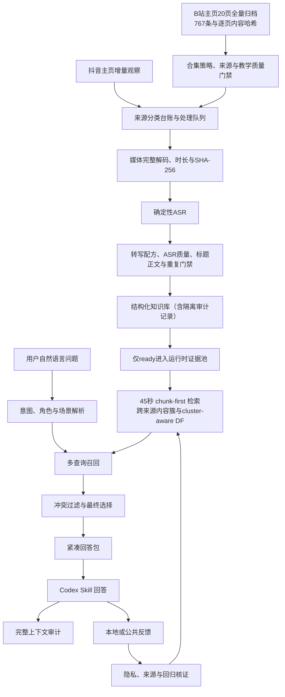

# Badminton Skills Coach

[](https://github.com/MuyuanGuo/badminton-skills-coach/actions/workflows/validate.yml)
[](https://github.com/MuyuanGuo/badminton-skills-coach/releases/latest)
[](LICENSE)


一个面向 Codex 的证据型 RAG 与知识工程项目：把公开的中文羽毛球教学视频转化为可检索、可引用、可回归验证的技术诊断、训练建议和视频证据。

> 你正在查看 `develop` 分支。当前开发版本是 **2.0.0-dev.1**，发布状态为 **unreleased**。面向使用者的稳定版说明位于 [`main`](https://github.com/MuyuanGuo/badminton-skills-coach/tree/main)，正式安装包请使用 [Releases](https://github.com/MuyuanGuo/badminton-skills-coach/releases/latest)。

[查看评测报告](https://muyuanguo.github.io/badminton-skills-coach/evaluation/) · [查看稳定版网站](https://muyuanguo.github.io/badminton-skills-coach/) · [English](README.en.md) · [贡献指南](CONTRIBUTING.md)

本项目独立开发，不是刘辉本人，也不代表其个人观点或背书。

## 为什么这个项目值得看

普通“关键词搜视频 + 大模型总结”很容易产生三类错误：

1. 找到相邻但错误的动作，例如用正手内容回答反手问题。
2. 把标题、标签或模型常识写成来源已经明确表达的结论。
3. 离线评测看起来很好，但真实回答、增量数据和发布产物无法复现或追责。

这个项目把问题拆成一组可独立验证的工程约束：

- 先解析动作、角色、场区、单双打、主动/被动和事件链，再进行多查询召回。
- 广泛召回后执行冲突过滤、硬负例排除和最终证据选择。
- 具体技术结论必须落到教学笔记、审核证据原子或带时间戳的转写窗口。
- 回答使用紧凑 `answer_packet`，完整上下文只用于最终审计，两者由 SHA-256 绑定。
- 数据更新、质量评测、产物同步和发布验证都使用确定性脚本与 CI 门禁。
- 用户反馈先经过隐私、来源和人工核证，再进入排序信号或回归集。

它展示的不只是一个能回答问题的 Skill，而是一套从非结构化视频到可审计 AI 输出的完整生产链路。

## 2.0 开发版的工程重点

### 证据边界，而不是“搜到就算相关”

检索层把标题和关键词限制为召回信号；回答层只允许引用本轮选中的 `V1...Vn` 视频与稳定 `evidence_id`。正手/反手、前场/后场、单打/双打、主动/被动、球员/搭档/对手等条件是结构化约束，不是提示词里的软要求。

### 闭环质量，而不是单一准确率

评测同时覆盖：

- 问题理解、动作范围、角色关系和多轮澄清。
- 候选召回、最终选择、主要证据命中和硬负例排除。
- 多来源扩展采用双轨检索评测：全源生产排序如实观测，稳定来源视图与发布基线同口径回归；未标注新来源另设暴露预算，防止证据洪泛。
- 逐结论证据、置信边界、答案完整性和引用一致性。
- 语言变体稳健性、反馈迁移隐私、历史盲测与当前运行时生成审计。
- 延迟、峰值内存和回答包体积预算。

### 可恢复的数据工程

增量更新不是直接覆盖生成文件。完整管线先记录前态，再构建知识库、索引、队列、图谱和发布参考文件；任一测试或门禁失败都会恢复本次触及的产物。成功后生成本地影响报告，列出视频状态迁移、索引变化、证据来源变化和构建 ID。

### Token 与运行时成本

模型只读取回答需要的紧凑证据包，不读取完整检索诊断、重复策略和全部候选。证据窗口在包内只存一次，claim、atom 和视频通过 `window_id` 引用；当前预算同时要求相对完整上下文至少缩减 50%、P95 不超过 12 KiB、单包不超过 16 KiB。

## 可验证结果

| 指标 | 当前值 | 约束 |
| --- | ---: | --- |
| 已处理公开视频 | 1242 | 来源处理记录，不等同于全部教学内容 |
| B 站完整来源目录 | 767 | 422 条回答就绪、345 条策略排除或质量隔离、0 条待处理 |
| 可用于回答的教学视频 | 776 | 仅 `processing_status: ready` 进入证据池 |
| 转写证据 | 757 | 7,668/7,668 条转写证据包含时间戳 |
| 视觉复核兜底 | 19 | 语音不足时使用已审核视觉摘要 |
| 回答质量黄金用例 | 57/57 | 覆盖文本、边界、视频与禁用结论 |
| 查询理解 | 143/143 | 当前结构化意图回归集 |
| 语言变体稳健性 | 30/30 | 5 类问题、15 个基础案例 |
| 硬负例误选 | 0 | 当前回归集共 194 个硬负例 |
| 最近一次独立人工生成审计 | 3/3 | 新运行时尚待独立人工复核，不冒充当前结果 |
| 公共反馈信号 | 0 | 机器闭环已就绪，不虚构真实用户数据 |

性能门禁使用 5 类问题的平衡样本，限制模块加载、查询规划、搜索、回答上下文和峰值内存。最近一次本地验收中，搜索 P95 为 `77.75 ms`、回答上下文 P95 为 `712.04 ms`、峰值追踪内存为 `80.15 MB`，回答包平均缩减 `71.22%`。这些是开发环境测量，不是跨机器性能承诺。

最近一次完成人工独立复核的生成式评测快照见 [evaluation report](https://muyuanguo.github.io/badminton-skills-coach/evaluation/)；本分支当前的确定性回归与性能结果以上述本地门禁为准，新运行时的生成式审计仍需独立人工复核。

## 系统架构


```mermaid
flowchart TD
    A1["抖音主页增量观察"] --> B["来源分类台账与处理队列"]
    A2["B站主页20页全量归档<br/>767条与逐页内容哈希"] --> O["合集策略、来源与教学质量门禁"]
    O --> B
    B --> C["媒体完整解码、时长与SHA-256"]
    C --> D["确定性ASR"]
    D --> P["转写配方、ASR质量、标题正文与重复门禁"]
    P --> E["结构化知识库（含隔离审计记录）"]
    E --> R["仅ready进入运行时证据池"]
    R --> F["45秒 chunk-first 检索<br/>跨来源内容簇与cluster-aware DF"]
    Q["用户自然语言问题"] --> G["意图、角色与场景解析"]
    G --> H["多查询召回"]
    F --> H
    H --> I["冲突过滤与最终选择"]
    I --> J["紧凑回答包"]
    J --> K["Codex Skill 回答"]
    K --> L["完整上下文审计"]
    K --> M["本地或公共反馈"]
    M --> N["隐私、来源与回归核证"]
    N --> F
```

新增转写不会写入模型权重或成为 Codex 的会话记忆。它只有先通过合集准入或独立来源核验，再通过媒体完整性、转写配方与 ASR 质量、标题正文一致性、证据抽取和去重，成为 `processing_status: ready` 的知识记录，并通过索引、回归、canary 与回答包预算验证及 Skill 安装后，才可能因为相关 chunk 在当前问题中被选中而影响回答。原始 `.json`、`.srt` 或 `.txt` 文件单独存在不会改变回答。

运行时主路径：

```text
query
  -> prepare_answer_context.py
  -> question_interpretation
  -> retrieval queries
  -> candidate conflict checks
  -> selected_videos
  -> answer_plan + claim_evidence_map
  -> answer_packet
  -> generated answer
  -> audit_answer.py
```

`search_knowledge.py` 是检索与诊断底层；`prepare_answer_context.py` 才是问答编排入口。这个边界防止调用方绕过意图解析、完备性契约和最终证据选择。

## 关键设计决策

### 数据与证据分层

- `data/knowledge/douyin_knowledge_base.json`：兼容旧路径的多来源统一知识库与视频处理状态。
- `data/knowledge/bilibili_knowledge_base.json`：通过用户确认合集策略或来源核验，并经过转写质量和跨平台去重门禁的 B 站构建产物。
- `data/bilibili_video_index.json`：大G羽毛球主页的 B 站元数据索引。
- `data/processing/bilibili_origin_review_queue.json`：保存无合集且尚未确认的候选；强制转写合集不会重复进入该队列。
- `data/processing/bilibili_queue.json`：已通过合集策略或来源门禁的媒体、转写和知识构建状态。
- `references/knowledge-base.json`：随 Skill 发布的运行时证据副本。
- `retrieval-index.json`：不包含完整转写正文的紧凑索引。
- `reviewed-evidence-atoms.json`：已审核范围的封闭结论与证据单元。
- 原始媒体、完整转写、临时 CDN、Cookie 和本地反馈不进入 Git。

`automatic_transcript`、`reviewed_transcript` 和 `visual_reviewed` 明确区分证据来源。自动转写不会被标记成人工事实；综合原则也不会伪装成视频逐字原话。

B 站接入执行用户确认的两层策略：8 个技术合集的 583 条视频与 19 条逐条确认的无合集视频必须转写并进入知识存储；5 个非目标合集的 156 条视频与 9 条逐条排除的视频不处理。稳定 List ID 与 BVID 共同把完整归档锁定为 `602 + 165 = 767`。合集确认与逐条确认只证明用户要求收录，不证明内容来自刘辉，因此分别记录为 `verified_collection_policy` 和 `verified_video_policy`；只有独立通过刘辉来源门的记录才标为 `verified_liuhui_clip`。B 站 SEO description 会拼入作者简介和相关视频，仍禁止作为来源证据。无论通过哪种准入方式，只有来源、转写与证据质量门全部通过的 `ready` 记录才能进入回答池。

单条记录未通过来源、转写、标题正文、自动证据或重复门禁时，会保留审计状态但保持非 `ready`，且不向运行时打包转写段。跨产物不变量、稳定语料回归或发布门失败时才回滚本轮生成产物。两类失败都不会静默进入检索或回答池，也不会被伪装成必须由真人清理的积压。

### 回答契约

回答模型依次读取：

1. `question_interpretation`：目标动作、角色、场景、排除项和事件链。
2. `boundary`：证据覆盖范围和必须声明的限制。
3. `answer_plan`：每个回答分支允许使用的结论。
4. `claim_evidence_map`：逐结论证据和置信上限。
5. `selected_videos`：唯一允许引用的视频集合。
6. `feedback_prompt`：与本轮 `V1...Vn` 映射一致的反馈格式。

完整上下文与紧凑包通过 canonical JSON SHA-256 绑定，防止模型读取的证据包与审计对象不一致。

### 反馈闭环与隐私

本地反馈默认留在用户机器。公开反馈必须经过单独的脱敏与公开授权，晋升前验证来源正文哈希、隐私字段、状态流转和对抗性迁移案例。用户反馈可以发现错误，但不会直接成为羽毛球技术事实。

### 增量更新与事务

```text
增量观察
  -> 来源分类与跨平台去重
  -> 下载/转写
  -> 证据质量检查
  -> 知识与索引重建
  -> 全量回归与性能预算
  -> 影响报告
  -> PR
```

构建产物使用原子写入；完整更新使用多文件回滚保护。影响报告检查 `ready` 视频与检索索引一致，并阻止未解释的 ready 视频移除。

## 测试与交付纪律

PR 的 `validate` 工作流包含：

- Python 3.10 / 3.12 静态与单元测试。
- 分片回答上下文回归。
- 质量报告、反馈生命周期、语言变体和性能预算。
- Skill 引用同步、构建可复现性、链接、DOM 与项目产物验证。

标签发布由独立的 `release` 工作流生成确定性 ZIP、SHA-256、CycloneDX SBOM 和 GitHub Artifact Attestation。CodeQL 使用 GitHub Default Setup 独立运行，不冒充 `validate` 中的步骤。

本地核心入口：

```bash
python3 scripts/doctor.py
python3 scripts/validate_project.py
python3 scripts/run_ci_tests.py fast
python3 scripts/run_ci_tests.py artifacts
python3 scripts/run_ci_tests.py context
python3 scripts/run_full_update_pipeline.py
```

新增 B 站证据使用 `run_bilibili_update_pipeline.py` 作为可恢复单入口。全量归档必须对账主页总数、连续页、逐页 BVID 内容哈希；下载只有在 PyAV 完整解码、时长和 SHA-256 全部通过后才进入转写。转写按单视频 checkpoint，随后执行按时长缩放的 ASR 质量门、标题正文一致性、B-B/B-抖音去重、45 秒 chunk 构建、机械 wiring canary、旧语料回归、性能和回答包预算。单条失败会保留 checkpoint 并按策略重试或终态隔离；生成级门禁失败会回滚本轮生成产物。

在 macOS 的 iCloud 同步工作区中，可将两平台转写放到非同步缓存，避免云端占位文件阻塞构建；知识记录仍写入可移植的仓库相对引用。构建和严格理解度验证共同识别这两个环境变量：

```bash
export BSC_DOUYIN_TRANSCRIPT_CACHE_DIR=/private/tmp/bsc-douyin-cache
export BSC_BILIBILI_TRANSCRIPT_CACHE_DIR=/private/tmp/bsc-bilibili-transcripts
python3 scripts/run_full_update_pipeline.py
```

中断后不要手工拼接子命令；重复运行同一条完整恢复命令即可跳过有效 checkpoint，并且只有全量终态、构建与验证都成功后才安装：

```bash
python3 scripts/run_bilibili_update_pipeline.py --install
```

完整发布阶段成功时写出本地 `output/update-impact-report.json`；发布阶段失败时自动回滚生成产物。

## 如何快速评审这个项目

如果你是招聘官或技术面试官，建议按以下顺序：

1. 阅读本 README 的“关键设计决策”，了解问题分解和边界。
2. 查看 [`prepare_answer_context.py`](skills/liuhui-badminton-coach/scripts/prepare_answer_context.py) 和 [`audit_answer.py`](skills/liuhui-badminton-coach/scripts/audit_answer.py)。
3. 查看 [`answer_quality_cases.json`](data/evaluation/answer_quality_cases.json) 中的正例、硬负例和禁用结论。
4. 打开 [评测报告](https://muyuanguo.github.io/badminton-skills-coach/evaluation/)。
5. 查看 [`run_full_update_pipeline.py`](scripts/run_full_update_pipeline.py) 的事务边界与质量门禁。
6. 查看 [GitHub Actions](https://github.com/MuyuanGuo/badminton-skills-coach/actions) 的跨版本验证与安全分析。

## 仓库结构

```text
skills/liuhui-badminton-coach/   可安装 Skill、运行时脚本与紧凑参考文件
data/                            来源台账、处理队列、知识构建与评测数据
config/                          分类、检索、回答、训练、反馈与性能规则
scripts/                         增量处理、构建、评测、验证和发布工具
docs/                            面向使用者的网站与确定性评测报告
output/                          知识图谱、审核队列与本地影响报告
```

## 分支与版本

- 当前分支：`develop`
- 当前开发版本：`2.0.0-dev.1`
- 发布状态：`unreleased`
- 当前稳定版：`main` / `v1.5.0`

`develop` README 面向招聘官、技术面试官和贡献者，强调工程设计与验证证据；`main` README 和 GitHub Pages 面向使用者，强调安装、提问方式与稳定能力。

发布 `2.0.0` 时，先在 `develop` 完成质量门禁，再通过 PR 合入 `main`，同步切换为稳定通道并生成 `v2.0.0` Release。不得把 `2.0.0-dev.1` 的开发状态写成已经发布。

## 技术栈与边界

Python 3、Codex Skills、JSON 规则与构建产物、faster-whisper、PyAV、yt-dlp、Chrome DevTools Protocol、BM25/字符 n-gram、SimHash/Jaccard 内容聚类、Node.js、Draw.io/Mermaid 和 GitHub Actions。

原创软件与自动化采用 [MIT License](LICENSE)。第三方视频、音频、创作者名称、标题、缩略图、转写及其他来源内容不包含在 MIT 授权中，详见 [NOTICE](NOTICE)。安全策略见 [SECURITY.md](SECURITY.md)，构建验证见 [RELEASE_SECURITY.md](RELEASE_SECURITY.md)。
